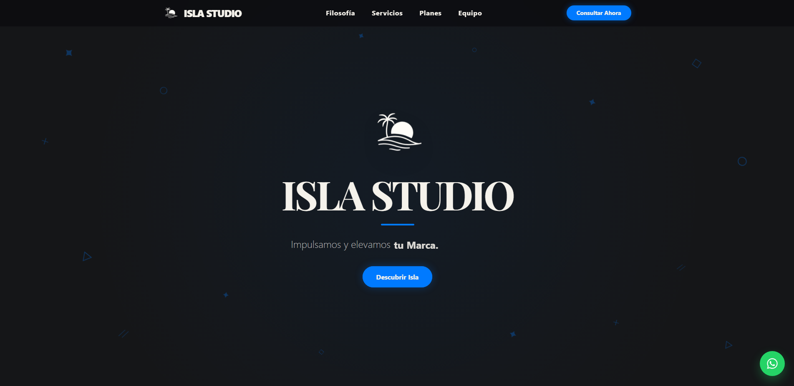
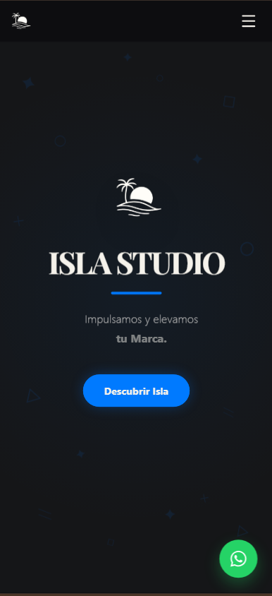
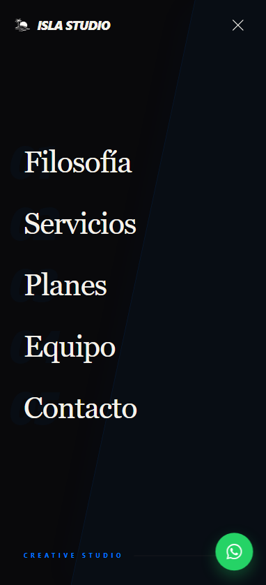

# 🌊 Isla Studio - Creative Agency Digital Experience


Landing page de alto impacto desarrollada para **Isla Studio**. Este proyecto combina una estética minimalista "Boutique" con soluciones técnicas avanzadas para garantizar una navegación fluida y profesional.

---

## 📸 Vista Previa
<h3 align="center">Pantalla Principal</h3>
<p align="center">
  
</p>

<h3 align="center">Pantalla Principal Mobile</h3>
<p align="center">
  
</p>

<h3 align="center">Menú Mobile</h3>
<p align="center">
  
</p>

> [!IMPORTANTE]
> **[Explora el sitio en vivo](https://pedrorosas25.github.io/isla-studio/)**

---

## 🚀 Desafíos Técnicos y Soluciones

Durante el desarrollo, nos enfocamos en resolver problemas comunes de la web moderna:

### 📱 Navegación "Asimétrica" Disruptiva
Diseñamos un menú móvil único que rompe con las listas centradas tradicionales. 
- **Efecto Skew:** Un bloque de color azul con inclinación diagonal que llena la pantalla de forma dinámica.
- **Tipografía de Autor:** Uso de fuentes *Serif* para secciones y *Sans Black Italic* para la identidad visual.
- **Micro-interacciones:** Números de sección gigantes con opacidad reducida (`0.04`) de fondo para dar profundidad de diseño editorial.

### ✉️ Lógica de Contacto Inteligente (Híbrida)
Implementamos un sistema de detección de dispositivo para el botón de Email:
- **En Móvil:** Dispara el protocolo `mailto:` abriendo la app nativa (Gmail/Mail).
- **En PC:** Genera una URL de redacción limpia de Gmail en una pestaña nueva, evitando errores de configuración de clientes de correo locales.

### ⚡ Optimización de Performance (Lags en Modales)
Corregimos problemas de rendimiento en los modales de Términos y Condiciones:
- Sustitución de filtros pesados por capas de color sólido.
- Implementación de `AnimatePresence` de Framer Motion para entradas y salidas suaves sin caídas de FPS.

### 💬 Conversión Directa
Integración de un **Floating Action Button (FAB)** para WhatsApp con efecto de pulso infinito, diseñado para aumentar la tasa de contacto directo sin interrumpir la lectura del contenido.

---

## 🛠️ Stack Tecnológico

- **Frontend:** React.js con hooks personalizados para el manejo de estados de modales y navegación.
- **Estilos:** Tailwind CSS (Mobile First).
- **Animaciones:** Framer Motion (Orquestación de gestos y transiciones).
- **Iconografía:** Lucide React & React Icons (Font Awesome/Tiktok/Whatsapp).

---

## 🏗️ Cómo ejecutar el proyecto

1. **Clonación:**
   ```bash
   git clone [https://github.com/pedrorosas25/isla-studio.git](https://github.com/pedrorosas25/isla-studio.git)
Si querés correr este proyecto de forma local:

1. Clona el repositorio:
   ```bash
   git clone [https://github.com/pedrorosas25/isla-studio.git](https://github.com/pedrorosas25/isla-studio.git)
